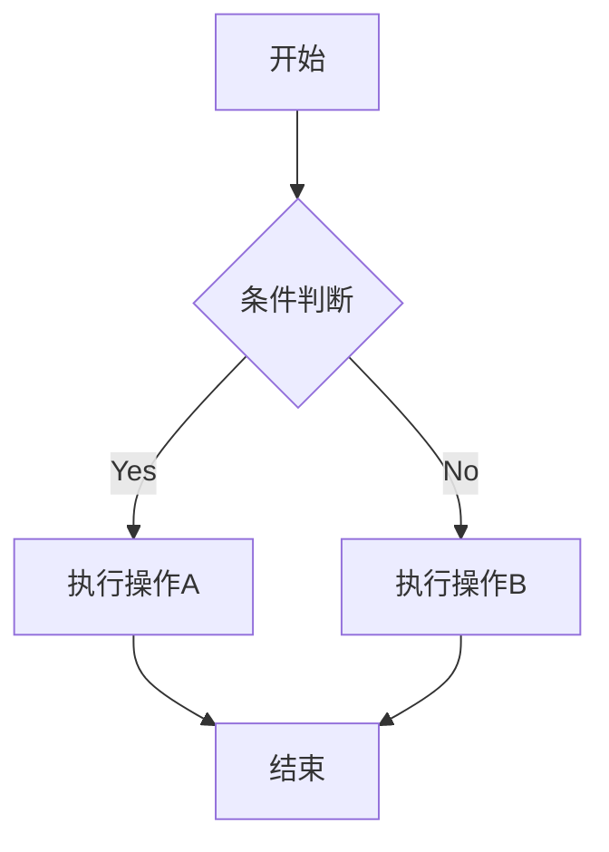

欢迎来到我的博客！

# 一级标题
## 二级标题
### 三级标题

测试**粗体**，测试*斜体*

测试[链接](https://www.kemiaosw.top)

测试图片:

- 无序
- 列表

1. 有序
2. 列表

- [ ] todo
-  [x] 待办列表

| 标题 | 第一 | 第二 |
| :--- | :---: | ---: |
| 左对齐 | 居中 | 右对齐 |

$$E = mc^2$$

$$\int_{-\infty}^{\infty} e^{-x^2} dx = \sqrt{\pi}$$